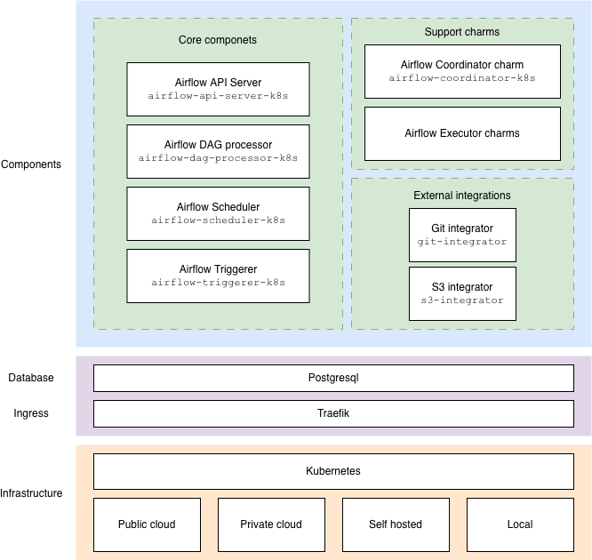
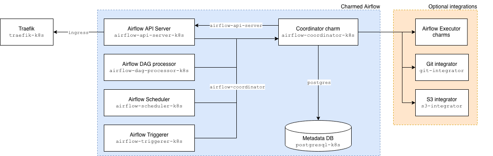

Architecture overview
=====================

Charmed Airflow is an open source, cloud-native solution that helps you
deploy `Apache Airflow`_ in a charmed way and operate it throughout its
lifecycle.

This document describes the layers that make it up, the role of each
component, and how those components are connected.

From the diagram above:

* **Infrastructure layer.** Charmed Airflow runs on any
  `CNCF-certified Kubernetes`_ distribution, whether on public cloud, private
  cloud, self-hosted infrastructure, or a local development cluster.
* **Ingress layer.** `Traefik`_ (``traefik-k8s``) terminates and routes
  external traffic to the Airflow web UI and REST API.
* **Database layer.** `PostgreSQL`_ (``postgresql-k8s``) provides the
  persistent metadata store that Airflow uses to track DAGs, task instances,
  and run history.
* **Components layer.** A set of purpose-built charms that run the Airflow
  services and coordinate their configuration. These are described in the
  :ref:`components` section below.

.. _components:

Components
----------

The components layer is split into three groups: the **core charms** that run
the Airflow services, the **support charms** that wire the deployment
together, and the **external integrators** that provide optional data
sources.

For the full configuration, actions, and relations of each charm, see the
:doc:`charm reference </reference/charms/index>`.

Core charms
~~~~~~~~~~~

The core charms each run one of the long-lived Airflow services inside a
workload container. They receive their Airflow configuration and secrets from
the :ref:`coordinator <coordinator-charm>` and share the same PostgreSQL
metadata database.

* **Airflow API Server** (``airflow-api-server-k8s``) – serves the Airflow
  web UI and exposes the REST API that clients use to interact with DAGs,
  runs, and task metadata.
* **Airflow Scheduler** (``airflow-scheduler-k8s``) – monitors DAGs and task
  instances, resolves their dependencies, and triggers task execution.
* **Airflow DAG Processor** (``airflow-dag-processor-k8s``) – continuously
  scans the configured DAG folder and parses Python files to discover and
  update DAG definitions.
* **Airflow Triggerer** (``airflow-triggerer-k8s``) – runs the asynchronous
  event loop that backs deferrable operators, freeing up worker capacity
  while tasks wait on external conditions.

Support charms
~~~~~~~~~~~~~~

.. _coordinator-charm:

* **Airflow Coordinator** (``airflow-coordinator-k8s``) is the central support
charm. It gathers configuration from every source in the deployment — user
configuration, defaults, database credentials, executor settings, and DAG
source integrators — merges it into a single consistent Airflow
configuration, and shares it with each core charm. As a result, the core
charms never need to consume those relations directly.

* **Airflow Executor charms** configure how Airflow schedules and runs DAG
tasks. Each executor charm advertises an executor-specific configuration
(such as a Pod template) to the coordinator, which forwards it to the core
charms. A deployment can use different executor charms depending on the
isolation, scaling, and resource requirements of its workloads. For example,
the :doc:`Airflow Kubernetes Executor </how-to/integrate/kubernetes-executor>`
runs each task as an isolated Kubernetes Pod.

External integrators
~~~~~~~~~~~~~~~~~~~~

External integrators are optional charms that let Charmed Airflow fetch DAGs
from sources outside the Kubernetes cluster. They allow operators to manage
DAG distribution without baking DAGs into container images.

* **Git integrator** (``git-integrator``) – provides the connection details
  and credentials for a remote Git repository containing DAGs.
* **S3 integrator** (``s3-integrator``) – provides the connection details and
  credentials for an S3-compatible object storage bucket containing DAGs.

Integrations
------------

Charmed Airflow components communicate through `Juju integrations`_, The diagram below
shows the integrations that connect the components of a Charmed Airflow deployment.

Required integrations
~~~~~~~~~~~~~~~~~~~~~

The following integrations must be in place for Charmed Airflow to reach an
active state:

* ``airflow-coordinator`` – connects each core charm (API server, scheduler,
  DAG processor, triggerer) to the coordinator. The coordinator sends the
  merged Airflow configuration to the core charms over this interface.
* ``airflow-api-server`` – used by the coordinator to collect connection
  information about the API server so it can be embedded in the shared
  configuration.
* ``postgresql`` – used by the coordinator to obtain credentials for
  the PostgreSQL metadata database, which are then propagated to the core
  charms.
* ``ingress`` – used by the API server to obtain a proxied, externally
  reachable endpoint from ``traefik-k8s``.

Optional integrations
~~~~~~~~~~~~~~~~~~~~~

The following integrations enable optional capabilities.

* ``airflow-kubernetes-executor-config`` – used by the coordinator to collect
  the configuration required by the Kubernetes executor, including the Pod
  template applied when tasks are scheduled as Kubernetes Pods.
* ``git`` – used by the coordinator to collect the connection information
  required to fetch DAGs from a Git repository, through the Git integrator.
* ``s3`` – used by the coordinator to collect the connection information
  required to fetch DAGs from an S3-compatible bucket, through the S3
  integrator.
