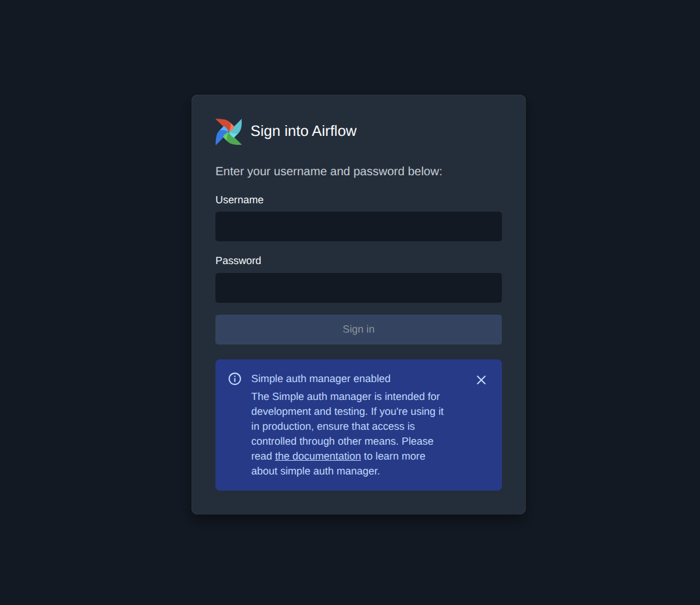
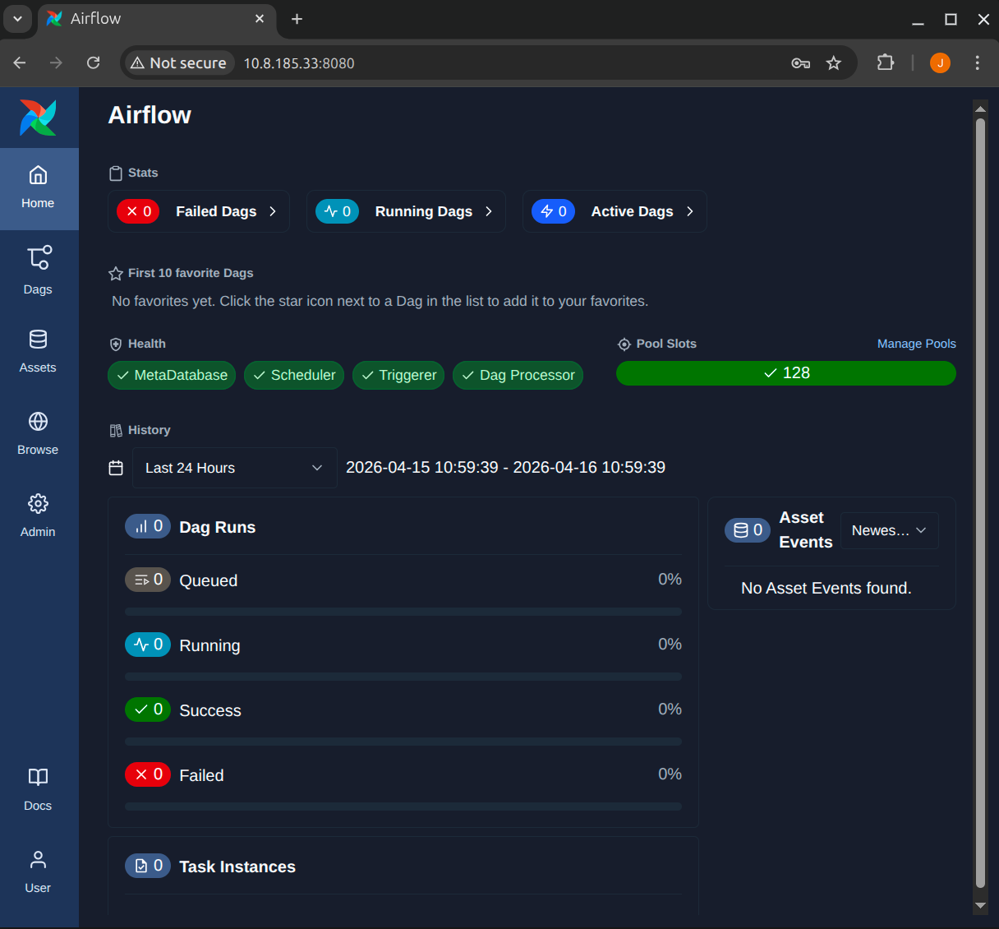

.. _deploy-airflow-tutorial:

Get Started
==================================

In this tutorial you will deploy a fully functional `Apache Airflow`_ cluster on
Kubernetes using `Juju`_ charms. By the end you will have a running Airflow
instance with an API Server UI you can access from your browser.

What you'll need
----------------

* Ubuntu 24.04 (or later).
* A machine with at least a **4-core CPU**, **8 GB RAM**, and **30 GB** of free
  disk space.
* A K8s cluster (v1.32+) with a Juju controller bootstrapped on it.

  See `Set up your juju deployment`_
  for a step-by-step guide.

What you'll do
--------------

#. Deploy the Airflow charms and their database.
#. Integrate the charms.
#. Access the Airflow API Server UI.

.. _deploy-charms:

Deploy the charms
-----------------

This section walks you through deploying and integrating the charms that comprise the Charmed Airflow solution.

Deploy PostgreSQL and PgBouncer Charms
~~~~~~~~~~~~~~~~~~~~~~~~~~~~~~~~~~~~~~

Airflow requires a PostgreSQL database to store metadata. Deploy the PostgreSQL
and PgBouncer charms (optionally for connection pooling for the PostgreSQL charm) first:

.. code-block:: bash

   juju deploy postgresql-k8s --trust

.. note::

   **PgBouncer charm is optional.** The PgBouncer charm is a connection pooler, reducing
   the number of direct connections to the PostgreSQL charm. It is recommended for
   production workloads but not required. 

   .. code-block:: bash

      juju deploy pgbouncer-k8s --trust

Deploy the Airflow Coordinator charm
~~~~~~~~~~~~~~~~~~~~~~~~~~~~~~~~~~~~

The Airflow Coordinator is the central configuration hub. It generates and distributes the Airflow configuration.

.. code-block:: bash

   juju deploy airflow-coordinator-k8s

Configure the Fernet key
~~~~~~~~~~~~~~~~~~~~~~~~

Airflow uses a `Fernet key`_ to encrypt sensitive data (such as connection
passwords and variables) in its metadata database. The Airflow Coordinator charm
requires this key to be provided as a Juju secret.

Generate a Fernet key and store it as a Juju secret:

.. code-block:: bash

   juju add-secret fernet-key-secret \
     fernet-key="$(python3 -c 'from cryptography.fernet import Fernet; print(Fernet.generate_key().decode())')"

Grant the secret to the Airflow Coordinator charm and configure it:

.. code-block:: bash

   juju grant-secret fernet-key-secret airflow-coordinator-k8s
   juju config airflow-coordinator-k8s \
     fernet_key_secret=secret:<secret-id>

.. note::

   Replace ``<secret-id>`` with the secret ID returned by ``juju add-secret``.
   You can find it with ``juju list-secrets``.

Deploy the core Airflow components
~~~~~~~~~~~~~~~~~~~~~~~~~~~~~~~~~~

Deploy the four core Airflow workload charms:

.. code-block:: bash

   juju deploy airflow-api-server-k8s
   juju deploy airflow-scheduler-k8s
   juju deploy airflow-dag-processor-k8s
   juju deploy airflow-triggerer-k8s

.. note::

  This tutorial deploys the latest supported versions of the Airflow Charms.
  To use other versions, refer to the `Charm Store`_.

These charms map to the Airflow components:

.. list-table::
   :header-rows: 1
   :widths: 30 70

   * - Charm
     - Purpose
   * - ``airflow-api-server-k8s``
     - Serves the Airflow dashboard UI and API Server.
   * - ``airflow-scheduler-k8s``
     - Schedules and triggers DAG runs.
   * - ``airflow-dag-processor-k8s``
     - Parses DAG files and updates the metadata database.
   * - ``airflow-triggerer-k8s``
     - Handles deferred (asynchronous) tasks.

.. _integrate-charms:

Integrate the charms
--------------------

Integrate the Airflow Coordinator charm with the database
~~~~~~~~~~~~~~~~~~~~~~~~~~~~~~~~~~~~~~~~~~~~~~~~~~~~~~~~~

.. code-block:: bash

   juju integrate airflow-coordinator-k8s:postgres postgresql-k8s:database

.. note::

  If you deployed the PgBouncer charm (recommended):

  .. code-block:: bash

    juju integrate pgbouncer-k8s:database postgresql-k8s:database
    juju integrate airflow-coordinator-k8s:postgres pgbouncer-k8s:database

Integrate the API server charm with the Airflow Coordinator charm
~~~~~~~~~~~~~~~~~~~~~~~~~~~~~~~~~~~~~~~~~~~~~~~~~~~~~~~~~~~~~~~~~

The API server integrates with the Airflow Coordinator to share its host and port 
information. This allows the Airflow Coordinator to include these details in the centralized 
``airflow.cfg``, which it then distributes across the entire cluster.

.. code-block:: bash

   juju integrate airflow-coordinator-k8s:airflow-api-server \
     airflow-api-server-k8s:airflow-api-server

Integrate all core charms with the Airflow Coordinator charm
~~~~~~~~~~~~~~~~~~~~~~~~~~~~~~~~~~~~~~~~~~~~~~~~~~~~~~~~~~~~

Every core charm receives its Airflow configuration from the Airflow Coordinator charm
through the ``airflow-coordinator`` integration:

.. code-block:: bash

   juju integrate airflow-coordinator-k8s:airflow-coordinator \
     airflow-api-server-k8s:airflow-coordinator

   juju integrate airflow-coordinator-k8s:airflow-coordinator \
     airflow-scheduler-k8s:airflow-coordinator

   juju integrate airflow-coordinator-k8s:airflow-coordinator \
     airflow-dag-processor-k8s:airflow-coordinator

   juju integrate airflow-coordinator-k8s:airflow-coordinator \
     airflow-triggerer-k8s:airflow-coordinator

Wait for the deployment
~~~~~~~~~~~~~~~~~~~~~~~

Monitor the status of deployment with ``juju status`` and wait until all applications and units show ``active/idle``. This can take
several minutes while the coordinator runs the initial database migration and
distributes the configuration.

.. _access-ui:

Access the Airflow UI
---------------------

The Airflow web UI is served by the API server charm on port **8080**. There
are several ways to reach it depending on your environment.

- Using the API Server Unit IP directly.
- Through traefik's External IP or subdomain. Refer to the :doc:`Traefik integration guide </how-to/integrate/traefik>` for details.

Retrieve the credentials from the API server pod:

.. code-block:: bash

   kubectl exec -it airflow-api-server-k8s-0 -c airflow-api-server \
     -n airflow -- cat /opt/airflow/simple_auth_manager_passwords.json.generated

Alternatively, search the API server logs:

.. code-block:: bash

   kubectl logs airflow-api-server-k8s-0 -c airflow-api-server -n airflow | grep -i password

Once done, you are all set to start navigating the dashboard:

Next steps
----------

* :doc:`Deploy with Terraform </how-to/deploy-with-terraform>` for an automated,
  reproducible deployment.
* :doc:`Integrate with Traefik </how-to/integrate/traefik>` for external HTTP/HTTPS
  access.
* :doc:`Integrate with Git Integrator </how-to/integrate/git-integrator>` to sync
  DAGs from a Git repository.
